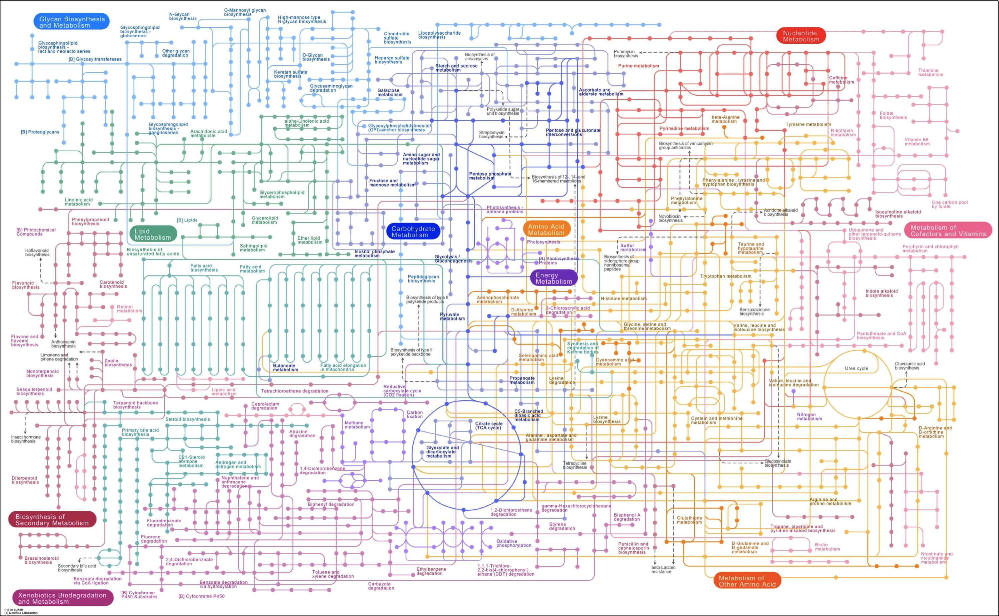

## Welcome to the Liao Research Lab (open on July 1, 2025)!

I am a systems biologist with a background in physics and computation. My lab at the [Department of Microbiology and Immunology](https://geiselmed.dartmouth.edu/microbio/), [GEISEL School of Medicine at Dartmouth College](https://geiselmed.dartmouth.edu), will focus on microbial metabolism within the human gut microbiome. Our long-term goal is to (1) uncover the mechanistic links between the intestinal microbiota and human health and (2) develop a computational platform that facilitates the rational design of microbiome-based therapies.
