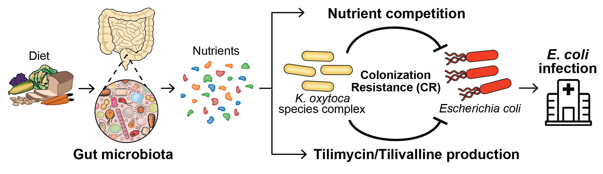

## Theme 1: Metabolic modeling of human gut microbiome

We aim to develop novel computational models (kinetic, constraint-based, and machine learning models) to infer metabolic activities within the human gut microbiome. Our focus extends beyond predicting overall fecal metabolomics to understanding the metabolic behavior of individual microbes. <strong>We ask: given microbiota multi-omics data, can we infer which microbes are producing or uptaking which metabolites, and how do these activities change over time?</strong> By predicting these metabolic activities, we can map out microbial interactions (e.g., nutrient competition, metabolic cross-feeding) difficult to measure experimentally.

Understanding these interactions further sheds light on how metabolites are cooperatively produced by multiple microbial species with distinct functions, and helps identify key species within the microbial interaction network. A well-known example is short-chain fatty acids (SCFAs), which are the primary metabolites produced in the colon through bacterial fermentation of dietary fibers and resistant starch. The production of SCFAs involves primary fermenters breaking down complex polysaccharides into simpler sugars, which secondary fermenters then utilize to produce acetate, propionate, and butyrate. Check out our [previous work](https://academic.oup.com/ismej/article/16/8/2040/7474293) on the mathematical modeling of ecological interactions involved in SCFA production!

This approach offers a new perspective on understanding microbial dysbiosis, because it allows us to uncover altered metabolic activities (rather than just metabolite levels) in patients, such as those with cystic fibrosis.
 

## Theme 2: Spectrometry-based fungal metabolomics

We will integrate experimental and computational metabolomics techniques to gain deeper insights into fungal metabolism in pathogens such as <i>Candida albicans</i>, <i>Candida parapsilosis</i>, and <i>Aspergillus fumigatus</i>. Fungal metabolism consists of two key aspects: metabolite abundance (the levels of different molecules in the cell) and metabolic flux (the rates at which these molecules are produced and consumed). While mass spectrometry directly measures metabolite abundance, metabolic flux is inferred indirectly from mass isotologue distributions (MIDs) in isotope labeling experiments. By combining insights from both metabolite abundance and flux, we aim to address clinically important questions related to fungal gut colonization, drug resistance, and infections, including:

**1. Why do some fungal strains cause infections in patients, while others remain harmless in the environment?**

**2. The yeast-to-hyphae transition is essential for <i>C. albicans</i> to invade host tissues. How does metabolism differ between these two morphological forms?**

**3. Fungi that develop antifungal resistance often acquire mutations in drug targets, which can reduce their fitness. How do they rewire their metabolism to compensate for this cost?**

**4. Beyond direct drug targets, cellular metabolism can additionally regulate antifungal drug efficacy. Which metabolites and metabolic pathways contribute to drug resistance?**

In an ongoing project, we are developing a computational pipeline to automate data processing for gas chromatography-mass spectrometry (GC-MS). This pipeline will convert raw GC-MS data into mass isotopologue distributions (MIDs) for metabolites in mass spectral databases such as Fiehn, GOLM and NIST. While these libraries contain reference spectra for over 270,000 compounds, nearly 80% of detected GC-MS spectra remain unidentified due to limited library coverage and incomplete structural information. To address the challenge, we are building deep neural network models (e.g., transformers) to predict molecular structures from mass spectra. The machine learning model will greatly enhance our ability to detect and analyze metabolites in GC-MS data. Our pipeline is compatible with both single and triple quadrupole GC-MS systems, which are the most widely used GC models globally. This broad compatibility democratizes access to advanced analytical instruments, making isotope tracing data analysis more accessible to a wider range of researchers.

## Theme 3: Colonization resistance and gut-borne infections

The intestinal microbiota is a major source of invasive microbial infections in immunocompromised patients, particularly those undergoing allogeneic hematopoietic cell transplantation. Despite routine administration of prophylactic antimicrobial drugs to prevent these infections, breakthrough infections caused by drug-resistant pathogens in the intestine remain a significant and life-threatening complication. One critical risk factor of these gut-borne infections is the loss of protective gut commensal bacteria, which provide colonization resistance against harmful pathogens.

	
[Our previous work](https://www.cell.com/cell-host-microbe/fulltext/S1931-3128(23)00220-2?dgcid=raven_jbs_etoc_email) showed that a higher abundance of <i>Klebsiella oxytoca</i> in the gut is associated with a lower risk of <i>Escherichia coli</i> infections. Our preliminary data demonstrated that clinical isolates of <i>K. oxytoca</i> outcompete <i>E. coli</i> in the mouse gut. We will use the two-species community as an example to study the role of microbial ecology in gut colonization resistance and infections. The observed colonization resistance can be attributed to nutrient competition and the production of DNA-alkylating enterotoxin tilimycin by <i>K. oxytoca</i>. Additionally, other gut commensal bacteria may influence <i>E. coli</i> colonization by interacting with both species, possibly by altering nutrient competition and tilimycin production. We will combine Biolog phenotyping, multi-omics profiling, and metabolic modeling to investigate the following questions:

**1. What nutrients favors the growth of <i>K. oxytoca</i> over <i>E. coli</i> in aerobic and anaerobic conditions?**

**2. What nutrients enable tilimycin production by <i>K. oxytoca</i>, and what is the associated signaling pathway?**

**3. What gut commensals are inhibited by tilimycin, and is the growth inhibition species- or strain-specific?**

Despite the simplicity of the model system, the interactions between the two bacteria are expected to be both dynamic and complex. Understanding these interactions is essential for identifying potential therapeutic strategies to restore protective gut microbiota in immunocompromised patients, where traditional antibiotics often fail. Moving forward, we plan to increase the complexity of the model system by incorporating additional gut commensals.

