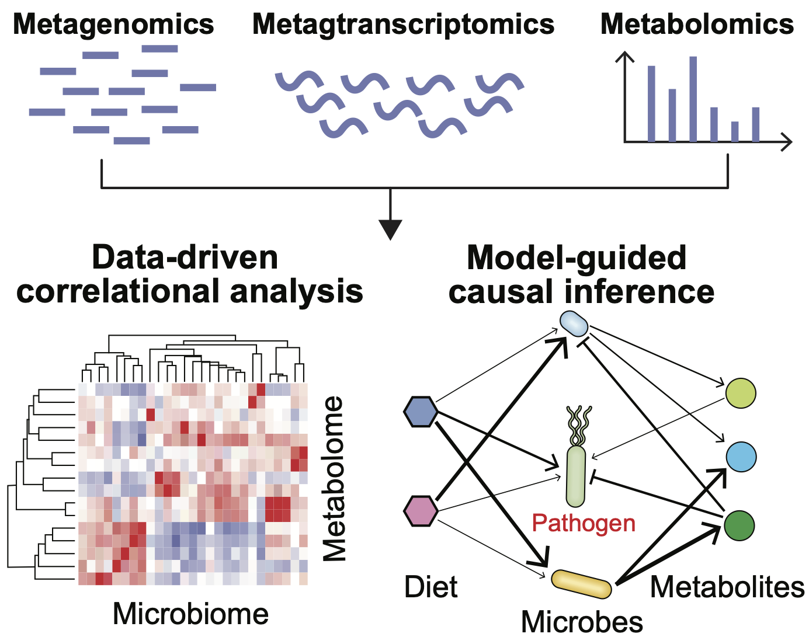

## Theme 1: Metabolic modeling of human gut microbiome

We aim to develop novel computational models (kinetic, constraint-based, and machine learning models) to infer metabolic activities within the human gut microbiome. Our focus extends beyond predicting overall fecal metabolomics to understanding the metabolic behavior of individual microbes. Specifically, we ask: given microbiota multi-omics data, can we infer which microbes are producing or uptaking which metabolites, and how do these activities change over time? By predicting these metabolic activities, we can map out microbial interactions (e.g., nutrient competition, metabolic cross-feeding) difficult to measure experimentally.

Understanding these interactions further sheds light on how metabolites are cooperatively produced by multiple microbial species with distinct functions, and helps identify key species within the microbial interaction network. A well-known example is short-chain fatty acids (SCFAs), which are the primary metabolites produced in the colon through bacterial fermentation of dietary fibers and resistant starch. The production of SCFAs involves primary fermenters breaking down complex polysaccharides into simpler sugars, which secondary fermenters then utilize to produce acetate, propionate, and butyrate. Check out our [previous work](https://academic.oup.com/ismej/article/16/8/2040/7474293) on the mathematical modeling of ecological interactions involved in SCFA production!

This approach offers a new perspective on understanding microbial dysbiosis, because it allows us to uncover altered metabolic activities (rather than just metabolite levels) in patients, such as those with cystic fibrosis.
 

## Theme 2: Spectrometry-based fungal metabolomics

__We aim to establish multiple complementary (experimental and computational) approaches to provide a detailed portrait of metabolic states in fungal pathogens such as *Candida albicans*, *Candida parapsilosis*, and *Aspergillus fumigatus*__. Cellular metabolism encompasses two key aspects: metabolite abundance and metabolic flux, both of which are crucial for a comprehensive understanding of metabolic states and the regulation of metabolic pathways. By developing these methods, we hope to address the most critical questions in fungal pathogenesis, including:

1. Why do some fungal strains colonize patients and cause infections while others are more commonly detected in the environment?
2. The morphological yeast-to-hyphae transition is crucial for *C. albicans* to invade host tissues. What are the metabolic differences between these two morphologies?
3. Fungal pathogens resistant to antifungal drugs may develop mutations in their primary drug targets, which can have a fitness cost. However, some pathogens can rewire their metabolic pathways to compensate for this cost. We ask: how do these fungal pathogens rewire their metabolic pathways to maintain metabolic homeostasis?
4. Although the primary antifungal drug target is undoubtedly important, secondary processes such as cellular metabolism can also affect antimicrobial potency. What are the metabolites and metabolic reactions that confer antifungal drug resistance? These metabolic targets with therapeutic potential will be experimentally validated in the laboratory.

A great challenge in metabolic profiling is that the vast majority of compounds in a mass spectrometry experiment cannot be identified due to limited coverage in existing libraries. **We will address this challenge by (1) developing deep neural network models (e.g., transformers) to predict molecular structures from mass spectra, and (2) using isotope labeling dynamics to provide additional information for compound identification.** Additionally, we are interested in developing a computational pipeline that automates the calculation of isotope labeling patterns from raw mass spectrometry data.

Metabolic flux can be quantified using isotope tracing data through metabolic flux analysis. However, the estimated fluxes are typically limited to a few canonical metabolic pathways. **We aim to develop a new approach that expands flux estimation to include more pathways, ultimately moving towards a genome-scale analysis**. The fundamental concept is to integrate bulk RNA-seq data with isotope labeling data. While metabolic fluxes estimated from isotope labeling data are accurate, they are limited to small-scale metabolic models. In contrast, RNA-seq data provides an indirect but genome-wide assessment of gene and metabolic activity. By combining these two data sources, we hope to leverage the strengths of both approaches.

## Direction 3: Microbial Ecology and metabolic regulation at cellular level

__At the cellular level, we are interested in the metabolic regulation of SCFA production. We ask how bacterial cells choose among alternative pathways under given nutrient conditions__. What is the best computational model and the minimal input data for accurate prediction of SCFA concentration? Is a dynamic flux balance model (knowledge-driven) or a machine learning model (data-driven) better? Can we develop a hybrid approach that combines the two types of models (i.e., knowledge-driven machine learning models)? Is genomic sequencing data sufficient for SCFA prediction, or is transcriptomic/proteomic data essential?

The intestinal microbiota is a major source of invasive microbial infections in immunocompromised patients, particularly those undergoing allogeneic hematopoietic cell transplantation (allo-HCT). Despite routine administration of prophylactic antimicrobial drugs to prevent these infections, breakthrough infections caused by drug-resistant pathogens in the intestine remain a significant and life-threatening complication. The biological mechanisms underlying these gut-borne infections are poorly understood, and predictive computational models of their occurrence are currently lacking. The lack of predictive models further impedes the development of personalized therapeutic strategies for preventing and treating these infections.
In this proposal, we plan to develop a multi-scale computational modeling framework to simulate gut-born infections. We will use Escherichia coli bloodstream infections in allo-HCT recipients as a case study for model development. Our previous research showed that these infections originate from gut, and a higher colonization level of Klebsiella species is associated with a lower risk of E. coli infections. Our preliminary data demonstrate that clinical isolates of K. michiganensis outcompete E. coli in the mouse gut. The observed colonization resistance in vivo can be attributed to nutrient competition and the production of DNA-alkylating enterotoxin tilimycin by K. michiganensis. While the role of Klebsiella species in colonization resistance has been consistently documented, other gut commensal bacteria (i.e., gut microbiota) may regulate the colonization of E. coli by interacting with both species. Due to the complex, dynamic host-pathogen-microbiota interactions, mathematical modeling is essential for systematic understanding of the infection development process, which is difficult to observe and manipulate experimentally. Therefore, we combine mathematical modeling and experimental validation to test our central hypothesis in the following aims: The human gut microbiota regulates K. michiganensis-mediated colonization resistance against E. coli by modifying the gut metabolic environment, which in turn alters nutrient competition and tilimycin production by K. michiganensis.
Aim 1: Modeling nutrient competition to identify gut nutrients that promote colonization resistance. Our in vitro competition assay identified 59 carbon sources that individually favor the anaerobic growth of tilimycin-deficient K. michiganensis over E. coli. However, how colonization resistance emerges from nutrient competition in the human gut, which contains a diverse array of diet-derived nutrients, remains underexplored. To address this challenge, we will aim 1a) Reconstruct genome-scale metabolic models of clinical isolates of K. michiganensis and E. coli; aim 1b) Validate the metabolic models and determine the metabolic basis of competition by quantifying and tracking intracellular carbon flows; and aim 1c) Simulate competition dynamics between tilimycin-deficient K. michiganensis and E. coli isolates under human diet-derived nutrients to identify nutritional profiles that promote colonization resistance. We will validate the predictions using synthetic media.
Aim 2: Modeling tilimycin production to elucidate its nutrient dependence and impact on bacterial commensals. It is well established that tilimycin has a broad toxicity to both pathogenic E. coli and commensal bacteria. Our preliminary data indicate that tilimycin production by K. michiganensis depends on the availability of carbon sources. To investigate how tilimycin mediates colonization resistance, we will aim 2a) Develop a kinetic model of tilimycin biosynthesis, and integrate it into the metabolic models developed in Aim 1. We will validate predicted tilimycin levels under various carbon sources; aim 2b) Measure tilimycin-induced growth inhibition of E. coli and representative gut commensals, and develop a machine learning model to predict the growth inhibition; and aim 2c) Simulate and experimentally validate competition dynamics between tilimycin-producing K. michiganensis and E. coli under human diet-derived nutrients. We will further quantify the relative contributions of nutrient competition versus tilimycin-induced inhibition to colonization resistance.
Aim 3: Modeling human gut microbiota to predict E. coli bloodstream infections in allo-HCT recipients. We observed interindividual variability in patients who developed E. coli infections, despite all of them harboring Klebsiella species in the gut. We hypothesize that this heterogeneous response is due to variability in the composition of their gut microbiota, which alter nutrient availability and, in turn, impact both mechanisms of colonization resistance. To test this hypothesis, we propose to aim 3a) Build a realistic spatiotemporal model that simulates E. coli infections in the presence of K. michiganensis and the gut microbiota; aim 3b) Simulate the mathematical model under various gut microbiota composition to identify gut commensal bacteria that promote K. michiganensis-mediated colonization resistance. The model predictions will be validate in vitro; aim 3c) Parameterize the model using pre-infection microbiota composition from allo-HCT recipients to predict the development of E. coli infection in these patients. The validatin data have already been collected.
Impact: This proposal addresses critical knowledge gaps in understanding and predicting how host-pathogen-microbiota interactions shape colonization resistance against gut-borne infections. The proposed computational framework integrates multiple biological scales and can be adapted to study other gut-borne infections and gut-microbiota-associated diseases. Finally, these models can be personalized and will inform therapeutic interventions to prevent and treat gut-borne infections in immune-compromised patients.

